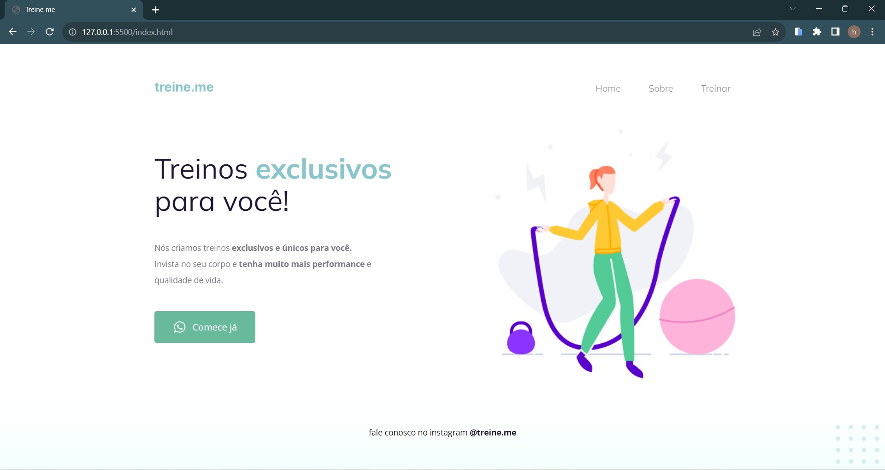

# Curso Explorer

Projetos 

Acesse meu repositório no Curso Explorer [Clique Aqui ](https://github.com/helena-antoni/curso-explorer)

 <table>
      <thead>
        <tr>
          <th>
          </th>
          <th>Projeto</th>
          <th>Data</th>
          <th>Visualizar</th>
          <th>Imagem</th>
        </tr>
      </thead>
      <tbody>
        <tr>
          <td>01</td>
          <td>Movéis Customizados</td>
          <td>14/11/2023</td>
          <td><a target="_blank" href="https://helena-antoni.github.io/curso-explorer/01-ambientes-unicos/">🔗</a></td>
          <td> </td>
        </tr>
        <tr>
          <td>02</td>
          <td>Treine.me</td>
          <td>17/11/2023</td>
          <td><a target="_blank" href="https://helena-antoni.github.io/curso-explorer/02-treine-me/">🔗</a></td>
          <td> </td>
        </tr>
      </tbody>
    </table>

 
