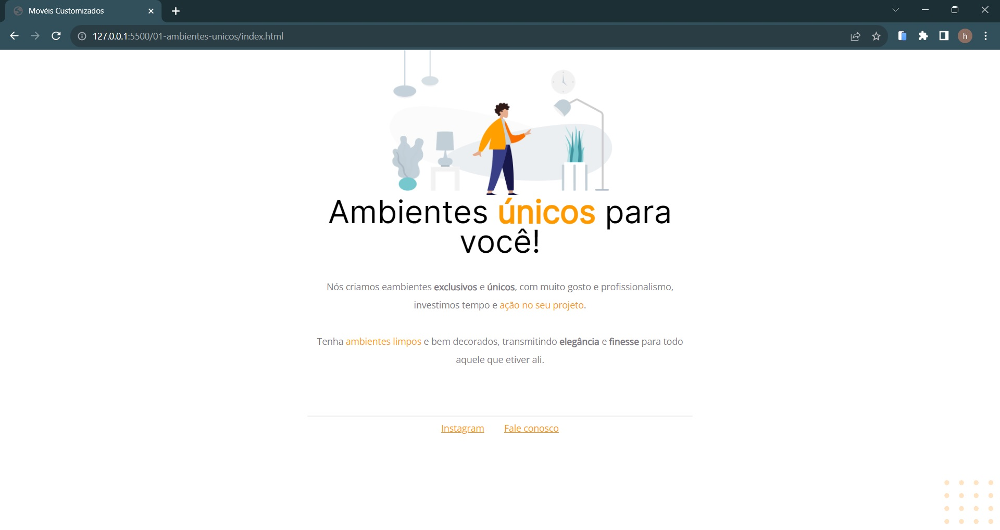
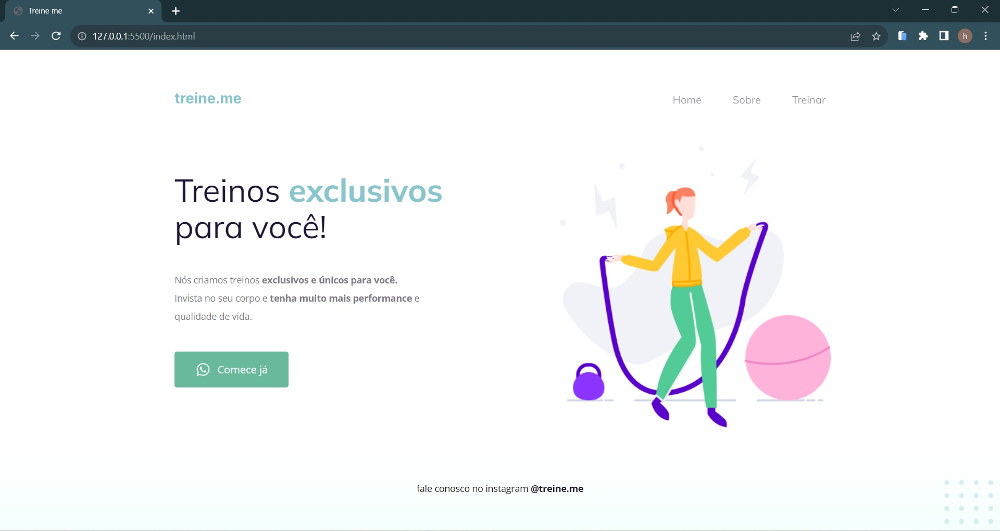
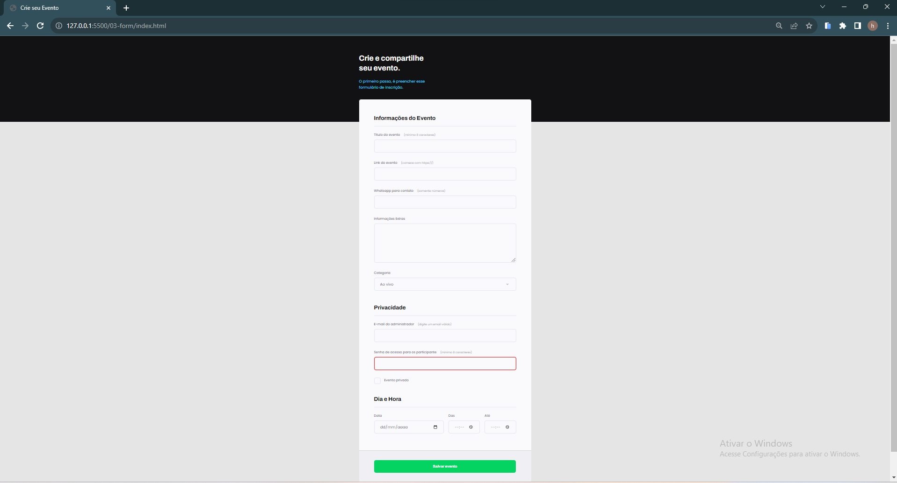
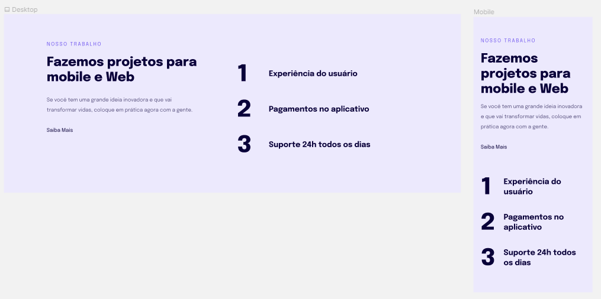
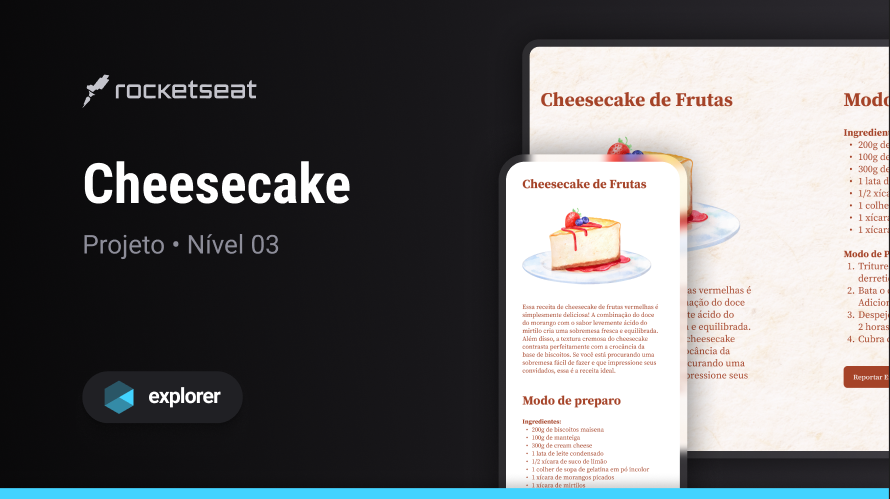
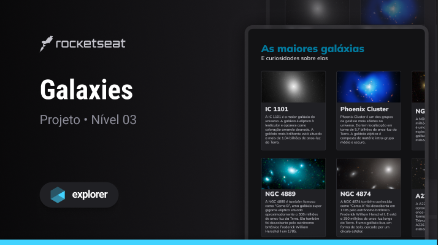
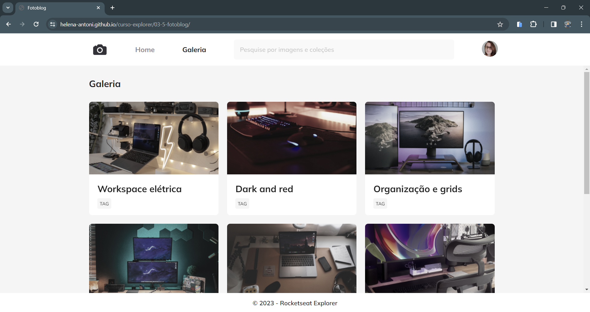

# Curso Explorer

Projetos 

Acesse meu repositório no Curso Explorer [Clique Aqui ](https://github.com/helena-antoni/curso-explorer)

 <table>
      <thead>
        <tr text-align="center">
          <th>
          </th>
          <th>Projeto</th>
          <th>Data</th>
          <th>Visualizar</th>
        </tr>
      </thead>
      <tbody>
        <tr>
          <td>01</td>
          <td>Movéis Customizados</td>
          <td>14/11/2023</td>
          <td> </td> 
          <td><a target="_blank" href="https://helena-antoni.github.io/curso-explorer/01-ambientes-unicos/">🔗</a></td>
        </tr> 
        <tr>
          <td>02</td>
          <td>Treine.me</td>
          <td>17/11/2023</td>
          <td> </td> 
          <td><a target="_blank" href="https://helena-antoni.github.io/curso-explorer/02-treine-me/">🔗</a></td>
        </tr>
        <tr>
          <td>03</td>
          <td>Form</td>
          <td>21/11/2023</td>
          <td></td> 
          <td><a target="_blank" href="https://helena-antoni.github.io/curso-explorer/03-01-form/">🔗</a></td>
        </tr> 
        <tr>
          <td>03-2</td>
          <td>Site Responsivo</td>
          <td>01/12/2023</td>
          <td> </td> 
          <td><a target="_blank" href="https://helena-antoni.github.io/curso-explorer/03-2-projects-mobile-and-web/">🔗</a></td>
        </tr>  
        <tr>
          <td>03-3</td>
          <td>Receita de Cheescake</td>
          <td>04/12/2023</td>
          <td> </td> 
          <td><a target="_blank" href="https://helena-antoni.github.io/curso-explorer/03-3-receita-cheescake/">🔗</a></td>
        </tr> 
        <tr>
          <td>03-4</td>
          <td>Galaxies</td>
          <td>12/12/2023</td>
          <td> </td> 
          <td><a target="_blank" href="https://helena-antoni.github.io/curso-explorer/03-4-galaxies/">🔗</a></td>
        </tr> 
         <tr>
          <td>03-5</td>
          <td>Fotoblog</td>
          <td>12/12/2023</td>
          <td> </td> 
          <td><a target="_blank" href="https://helena-antoni.github.io/curso-explorer/03-5-fotoblog/">🔗</a></td>
        </tr> 
      </tbody>